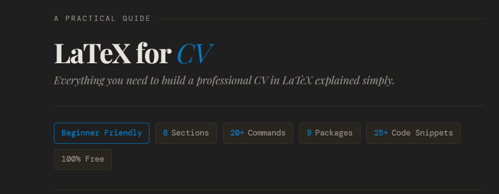

<div dir="rtl">



<div align="center">

[](https://github.com/Muhammed-Maklad/Creating-CV-With-Latex)
[](https://opensource.org/licenses/MIT)
[](http://makeapullrequest.com)

</div>
<div align="center">

## [For Documentation English Version](./README.MD)
</div> 

<div align="center">

[](https://www.linkedin.com/in/muhammed-maklad/)

</div>

### تقدر تستخدم التمبليت اللي عملته وهتلاقيه في ملف [**CV Template**](./CV%20Template.tex). كيّفه براحتك على حسب بياناتك، أو **اقرأ الشرح الكامل جوا الدوكيومنت ده**.

1. افتح **[overleaf.com](https://www.overleaf.com)**
2. عمل **اكونت مجاني**
3. اضغط **New Project ← Blank Project**
4. انسخ الكود من ملف [**CV Template**](./CV%20Template.tex)، حطه في مشروعك، وغيّر البيانات ببياناتك الشخصية

<br>

> ### وفي الآخر، متنساش تراجع السي في بتاعك على [ATS optimization](https://www.resumego.net/resume-checker/)  ده بيضمن إن السيستم الأوتوماتيكي يقراه صح

---

## 📚 فهرس المحتويات

1. [ليه LaTeX أصلاً؟](#1-ليه-latex-أصلاً)
2. [ابدأ من هنا](#2-ابدأ-من-هنا)
3. [هيكل ملف السي في](#3-هيكل-ملف-السي-في)
4. [الأوامر الأساسية في السي في](#4-الأوامر-الأساسية-في-السي-في)
   - [4.1 تنسيق النص](#41-تنسيق-النص)
   - [4.2 العناوين والأقسام](#42-العناوين-والأقسام)
   - [4.3 القوائم والنقط](#43-القوائم-والنقط)
   - [4.4 الخطوط الفاصلة](#44-الخطوط-الفاصلة)
   - [4.5 المسافات والتباعد](#45-المسافات-والتباعد)
   - [4.6 روابط قابلة للنقر](#46-روابط-قابلة-للنقر)
   - [4.7 محاذاة التواريخ لليمين](#47-محاذاة-التواريخ-لليمين)
5. [بناء السي في قسم بقسم](#5-بناء-السي-في-قسم-بقسم)
   - [5.1 الهيدر اسمك ومعلومات التواصل](#51-الهيدر--اسمك-ومعلومات-التواصل)
   - [5.2 الملخص الشخصي](#52-الملخص-الشخصي)
   - [5.3 الخبرة العملية](#53-الخبرة-العملية)
   - [5.4 المؤهل التعليمي](#54-المؤهل-التعليمي)
   - [5.5 المهارات](#55-المهارات)
   - [5.6 المشاريع](#56-المشاريع)
   - [5.7 الشهادات والكورسات](#57-الشهادات-والكورسات)
6. [نصايح التنسيق والتصميم](#6-نصايح-التنسيق-والتصميم)
7. [الباكدجز المهمة للسي في](#7-الباكدجز-المهمة-للسي-في)
8. [أشهر المشاكل وحلولها](#8-أشهر-المشاكل-وحلولها)

---

## 1. ليه LaTeX أصلاً؟

LaTeX هو نظام لكتابة وتنسيق المستندات بشكل احترافي، وبيستخدمه المهندسون والباحثون والأكاديميون حول العالم. بدل ما تضغط على زرار Bold أو تتعب في محاذاة حاجة يدوياً زي ما بنعمل في Word، إنت بتكتب أوامر وLaTeX هو اللي بيتكفل بكل التنسيق تلقائياً  وبدقة مش بتتغير.

| الميزة | LaTeX 🧾 | Microsoft Word 📝 |
|---|---|---|
| ✍️ طريقة الكتابة | نص + أوامر | ضغط على أزرار وتنسيق يدوي |
| 🎯 التركيز | المحتوى والهيكل أولاً | الشكل والمظهر |
| 📄 جودة الإخراج | PDF احترافي ومتسق دايماً | ممكن يتغير من جهاز لجهاز |
| 📐 المعادلات | ممتاز جداً | محدود وصعب أحياناً |
| 🔁 التنسيق | أوتوماتيكي ومتسق | يدوي وممكن يتغير |
| 📚 الأفضل لـ | السي في، البحوث، الرسايل العلمية | المستندات البسيطة والملاحظات |

### ليه LaTeX بالتحديد للسي في؟

| الميزة | الشرح |
|---|---|
| 🎯 **تنسيق بيكسل بيكسل** | كل حاجة في مكانها بالظبط  التواريخ، العناوين، النقط |
| 💼 **شكل احترافي** | اللي بيستخدمه المهندسين والباحثين في كل الدنيا |
| ✏️ **سهل التعديل** | غيّر المحتوى من غير ما تخرب التصميم |
| 🆓 **تمبليتات مجانية** | آلاف التصاميم الجاهزة على Overleaf |

### مقارنة سريعة: إزاي تعمل Bold في كل أداة؟

| الأداة | الطريقة |
|---|---|
| Word / Google Docs | اضغط زرار **B** |
| LaTeX | اكتب `\textbf{النص هنا}` |

---

## 2. ابدأ من هنا

### ✅ الأسهل والأنصح: استخدم Overleaf (من غير تنزيل أي حاجة)

Overleaf هو محرر LaTeX شغّال على المتصفح مباشرةً  مجاني، ومحتاجش تنزل برامج أو تفتح terminal. فتحه وابدأ.

**الخطوات خطوة بخطوة:**

1. افتح **[overleaf.com](https://www.overleaf.com)**
2. عمل **اكونت مجاني**
3. اضغط **New Project ← Blank Project**

> 💡 **تلميح:** Overleaf بيترجم كودك في الحال وبيعرضلك الـ PDF على طول على الشاشة. مفيش أي إعداد مطلوب.

---


## 3. هيكل ملف السي في

كل ملف LaTeX للسي في بيتبع نفس الشكل الأساسي ده:

```latex
% a4paper = حجم الورقة A4 | 11pt = حجم الخط (ممكن يبقى 10pt أو 12pt)
\documentclass[a4paper, 11pt]{article}

% ── البريمبل (الإعدادات) ──────────────────────────────────
% حط الباكدجز هنا (قبل \begin{document})
\usepackage{geometry}   % بيتحكم في هوامش الصفحة
\usepackage{hyperref}   % بيخلي الروابط قابلة للنقر في الـ PDF

% ── جسم المستند ───────────────────────────────────────────
\begin{document}

  % أقسام السي في بتيجي هنا

\end{document}
% أي كلام بعد \end{document} مش هيظهر في الـ PDF
```

### كل جزء بيعمل إيه؟

| الجزء | وظيفته |
|---|---|
| `\documentclass[a4paper, 11pt]{article}` | بيضبط الورقة على A4 وحجم الخط على 11pt |
| `\usepackage{...}` | بيحمّل ميزات إضافية (تحكم في الهوامش، روابط قابلة للنقر...) |
| `\begin{document}` | هنا بيبدأ محتوى السي في الفعلي |
| `\end{document}` | نهاية المستند — أي حاجة بعده مش هتتطبع |

---

## 4. الأوامر الأساسية في السي في

### 4.1 تنسيق النص

```latex
\textbf{المسمى الوظيفي هنا}          % بولد (عريض) — للمسميات الوظيفية وأسماء الشركات
\textit{اسم الجامعة هنا}             % مائل لأسماء المؤسسات والتواريخ
\underline{النص}                     % تحته خط  استخدمه بقلة
\textbf{\textit{النص}}               % بولد + مائل مع بعض
```

| الأمر | الشكل | الأفضل استخدامه في |
|---|---|---|
| `\textbf{text}` | **نص عريض** | المسميات الوظيفية وأسماء الشركات |
| `\textit{text}` | *نص مائل* | أسماء المؤسسات والتواريخ |
| `\underline{text}` | <u>نص</u> | استخدمه بحذر |
| `\textbf{\textit{text}}` | ***نص*** | لما تحتاج تأكيد أقوى |

---

### 4.2 العناوين والأقسام

> ⚠️ **دايماً استخدم `\section*{}` بالنجمة (`*`) في السي في.**
> من غيرها، LaTeX هيطبع "1. Experience"، "2. Education" وده مش مناسب في السي في.

```latex
\section*{Experience}    % ✅ صح — من غير رقم
\section{Experience}     % ❌ غلط للسي في — هيطبع "1. Experience"

\subsection*{المسمى الوظيفي}  % عنوان فرعي أصغر — كمان استخدم النجمة
```

---

### 4.3 القوائم والنقط

**قايمة بنقط** (`itemize`) — الأكثر استخداماً في السي في، لقائمة المهام والإنجازات:

```latex
\begin{itemize}
  \item % اكتب أول إنجاز أو مسؤولية هنا
  \item % اكتب تاني إنجاز هنا
  \item % اتارجت من 2 لـ 4 نقط لكل وظيفة
\end{itemize}
```

**قايمة من غير نقط** — شكل أنظف، كويس لقائمة الأدوات والمهارات:

```latex
\begin{itemize}
  \renewcommand{\labelitemi}{}  % السطر ده بيشيل رمز النقطة
  \item % المهارة أو الأداة هنا
  \item % مهارة تانية هنا
\end{itemize}
```

**قايمة وصفية** — الأنسب لقسم المهارات (عنوان + محتوى):

```latex
\begin{description}
  \item[Languages:]   % لغات البرمجة بتاعتك هنا
  \item[Frameworks:]  % الفريمووركس اللي بتشتغل بيها
  \item[Tools:]       % الأدوات والمنصات
  \item[Spoken:]      % اللغات المحكية — مثلاً: Arabic (Native)، English (Fluent)
\end{description}
```

---

### 4.4 الخطوط الفاصلة

بيستخدموا عشان يفصلوا بين أقسام السي في بصرياً:

```latex
\hrule          % بيرسم خط رفيع على طول الصفحة
\vspace{4pt}    % بيحط مسافة صغيرة تحت الخط عشان النص ما يلزقش فيه
```

---

### 4.5 المسافات والتباعد

```latex
\vspace{6pt}    % بيحرك العنصر الجاي لتحت بـ 6 نقاط
\vspace{-4pt}   % بيرفع العنصر الجاي لفوق — بيضيّق المسافة
\hspace{10pt}   % بيضيف مسافة أفقية في نفس السطر
\noindent       % بيوقف الـ indent الأوتوماتيكي للفقرة
\newpage        % بيبدأ صفحة جديدة — مفيد للسي في اللي فيه صفحتين
```

> 💡 `pt` = نقطة قياس. **1pt ≈ 0.35mm.**
> قيم شايعة: `4pt` (ضيق) · `6pt` (عادي) · `10pt` (واسع)

---

### 4.6 روابط قابلة للنقر

```latex
% ── في البريمبل ──────────────────────────────────────────
\usepackage{hyperref}
\hypersetup{colorlinks=true, urlcolor=blue}  % بيخلي الروابط زرقاء وقابلة للنقر

% ── جوا المستند ──────────────────────────────────────────
% \href{الرابط الفعلي}{النص اللي هيظهر للقارئ}
\href{mailto:your@email.com}{your@email.com}
\href{https://linkedin.com/in/yourprofile}{linkedin.com/in/yourprofile}
\href{https://github.com/yourusername}{github.com/yourusername}
```

---

### 4.7 محاذاة التواريخ لليمين

الشكل الكلاسيكي للسي في: اسم الوظيفة على الشمال، والتاريخ على اليمين تماماً:

```latex
\noindent
\textbf{المسمى الوظيفي هنا} — \textit{اسم الشركة، المدينة}
\hfill                  % \hfill بيملا الفراغ الفاضي ويدفع التاريخ ليمين
\textit{شهر البداية سنة – شهر النهاية سنة}  % اكتب "Present" لو لسه شغّال
```

---

## 5. بناء السي في قسم بقسم

### 5.1 الهيدر — اسمك ومعلومات التواصل

```latex
\begin{center}
  {\Huge \textbf{اسمك الكامل هنا}} \\[4pt]
  % \Huge = خط كبير جداً | \\[4pt] = سطر جديد + مسافة 4pt

  {\large المسمى الوظيفي أو الشعار الشخصي هنا} \\[6pt]
  % \large = أكبر شوية من النص العادي

  % بيانات التواصل في سطر واحد — \quad = مسافة متوسطة بين الحاجات
  \href{mailto:your@email.com}{your@email.com} \quad
  رقم تليفونك هنا \quad
  مدينتك، بلدك هنا \\[2pt]

  % حساباتك الأونلاين
  \href{https://linkedin.com/in/yourprofile}{linkedin.com/in/yourprofile} \quad
  \href{https://github.com/yourusername}{github.com/yourusername}
\end{center}

\vspace{8pt}  % مسافة بين الهيدر والخط الفاصل
\hrule        % خط أفقي يفصل الهيدر عن باقي السي في
```

---

### 5.2 الملخص الشخصي

```latex
\section*{Summary}
% اكتب 2 أو 3 جمل: مجالك، سنين خبرتك، وأقوى حاجات عندك.
% خليه مختصر — 3 سطور بالكتير.
```

---

### 5.3 الخبرة العملية

```latex
\section*{Experience}
\hrule
\vspace{6pt}

% ── كرر الجزء ده لكل وظيفة (الأحدث أولاً) ──────────────
\noindent
\textbf{المسمى الوظيفي هنا} — \textit{اسم الشركة، المدينة}
\hfill \textit{شهر البداية سنة – شهر النهاية سنة}
\begin{itemize}
  \item % وصف إنجاز — حاول تحط أرقام: "خفضت X بنسبة 30\%"
  \item % مسؤولية تانية أو إنجاز
  \item % اتارجت من 2 لـ 4 نقط لكل وظيفة
\end{itemize}

\vspace{4pt}  % مسافة صغيرة بين كل وظيفة والتانية
% ── الصق الجزء ده تاني للوظيفة اللي بعدها ─────────────
```

---

### 5.4 المؤهل التعليمي

```latex
\section*{Education}
\hrule
\vspace{6pt}

\noindent
\textbf{الدرجة العلمية هنا} — \textit{اسم الجامعة، المدينة}
\hfill \textit{سنة البداية – سنة التخرج}
\begin{itemize}
  \item GPA: درجتك هنا
  \item Graduation Project: وصف مختصر لمشروع التخرج
\end{itemize}
```

---

### 5.5 المهارات

```latex
\section*{Skills}
\hrule
\vspace{6pt}

\begin{description}
  \item[Languages:]   % لغات البرمجة بتاعتك
  \item[Frameworks:]  % الفريمووركس
  \item[Tools:]       % الأدوات والمنصات والبرامج
  \item[Spoken:]      % اللغات المحكية
\end{description}
```

---

### 5.6 المشاريع

```latex
\section*{Projects}
\hrule
\vspace{6pt}

% ── كرر الجزء ده لكل مشروع ──────────────────────────────
\noindent
\textbf{اسم المشروع هنا}
\hfill \href{https://github.com/yourusername/project}{github.com/yourusername/project}
\begin{itemize}
  \item % المشروع بيعمل إيه والتقنيات اللي استخدمتها
  \item % ميزة مهمة أو نتيجة أو رقم محدد
\end{itemize}

\vspace{4pt}  % مسافة بين المشاريع
% ── الصق الجزء ده للمشروع الجاي ──────────────────────────
```

---

### 5.7 الشهادات والكورسات

```latex
\section*{Certifications}
\hrule
\vspace{6pt}

\begin{itemize}
  \item اسم الشهادة — \textit{الجهة المانحة، السنة}
  \item اسم الشهادة — \textit{الجهة المانحة، السنة}
\end{itemize}
```

---

## 6. نصايح التنسيق والتصميم

### هوامش الصفحة

الهوامش الافتراضية في LaTeX واسعة أوي للسي في. ضيّقها كده:

```latex
% top/bottom = هامش فوق وتحت | left/right = هامش يمين وشمال
\usepackage[top=1.5cm, bottom=1.5cm, left=1.8cm, right=1.8cm]{geometry}
```

### حجم الخط

```latex
\documentclass[a4paper, 10pt]{article}  % مضغوط — بيوّفر مساحة، كويس للسي في بصفحة واحدة
\documentclass[a4paper, 11pt]{article}  % معياري — الأفضل في الوضوح (✅ الأنسب)
\documentclass[a4paper, 12pt]{article}  % كبير — سهل القراءة، بيآخد مساحة أكبر
```

### إزالة أرقام الصفحات

```latex
\pagestyle{empty}  % حطها في البريمبل — بتشيل أرقام الصفحات من كل الصفحات
```

### تغيير الخط

```latex
\usepackage{lmodern}  % خط عصري ونظيف — الاختيار الافتراضي الأنسب ✅
\usepackage{times}    % على غرار Times New Roman — تقليدي ورسمي
\usepackage{helvet}   % على غرار Helvetica — نظيف وعصري بدون سيريف
\renewcommand{\familydefault}{\sfdefault}  % بيحول كل المستند لخط sans-serif
```

### ضغط مسافات القوائم

المسافات الافتراضية بين النقط كبيرة أوي للسي في. صلّحها بـ `enumitem`:

```latex
% في البريمبل:
\usepackage{enumitem}

% استخدم [noitemsep, topsep=2pt] مع كل قايمة:
\begin{itemize}[noitemsep, topsep=2pt]
  % noitemsep  = بيشيل المسافة بين النقط
  % topsep=2pt = بيقلل المسافة فوق القايمة كلها
  \item العنصر هنا
  \item عنصر تاني
\end{itemize}
```

---

## 7. الباكدجز المهمة للسي في

| الباكدج | وظيفته | طريقة الاستخدام |
|---|---|---|
| `geometry` | التحكم في هوامش الصفحة | `\usepackage[margin=1.5cm]{geometry}` |
| `hyperref` | روابط قابلة للنقر في الـ PDF | `\usepackage{hyperref}` |
| `enumitem` | قوائم مضغوطة وقابلة للتخصيص | `\usepackage{enumitem}` |
| `fontawesome5` | أيقونات: إيميل، تليفون، GitHub... | `\usepackage{fontawesome5}` |
| `titlesec` | تنسيق شكل عناوين الأقسام | `\usepackage{titlesec}` |
| `xcolor` | نص ملوّن | `\usepackage{xcolor}` |
| `multicol` | تخطيط بعمودين | `\usepackage{multicol}` |
| `lmodern` | خط عصري ونظيف | `\usepackage{lmodern}` |
| `moderncv` | تصاميم سي في جاهزة وكاملة | `\documentclass{moderncv}` |

### إضافة أيقونات بـ `fontawesome5`

```latex
% في البريمبل:
\usepackage{fontawesome5}

% جوا المستند:
\faEnvelope\  إيميلك هنا \quad
\faPhone\     رقم تليفونك هنا \quad
\faLinkedin\  رابط لينكدإن بتاعك \quad
\faGithub\    رابط جيتهاب بتاعك
```

### تلوين عناوين الأقسام

```latex
\usepackage{xcolor}
\usepackage{titlesec}

% بيتطبق على كل \section*{} في مستندك:
\titleformat{\section}
  {\large\bfseries\color{blue!70!black}}  % الحجم | بولد | اللون
  {}{0pt}{}[\titlerule]                   % \titlerule بيرسم خط تحت العنوان

% غيّر blue!70!black لأي لون: red, teal, gray!80, إلخ
```

---

## 8. أشهر المشاكل وحلولها

| ❌ المشكلة | 🔍 السبب | ✅ الحل |
|---|---|---|
| القسم بيظهر "1. Experience" | استخدمت `\section{}` من غير `*` | غيّرها لـ `\section*{}` |
| النص بيخرج عن الصفحة | السطر طويل أوي | استخدم `\linebreak` أو اختصر النص |
| علامة `%` بتاخد أو بتعمل مشكلة | `%` في LaTeX معناها تعليق | اكتب `\%` عشان تطبعها كنص |
| `&` بتسبب خطأ في الكومبايل | `&` محجوزة للجداول | اكتب `\&` |
| النقط متفرقة أوي | التباعد الافتراضي كبير | استخدم `enumitem` مع `[noitemsep]` |
| الهوامش واسعة أوي | الهوامش الافتراضية في LaTeX | أضف `\usepackage[margin=1.5cm]{geometry}` |
| الروابط مش قابلة للنقر | `hyperref` مش محملة | أضف `\usepackage{hyperref}` في البريمبل |
| الخط شايف قديم | خط Computer Modern الافتراضي | أضف `\usepackage{lmodern}` |

### الرموز الخاصة  دايماً حط قبلها `\`

الرموز دي ليها معنى خاص في LaTeX. لو عايز تطبعها كنص عادي، حط قبلها `\`:

| الرمز المطلوب | اكتب في LaTeX |
|---|---|
| `%` | `\%` |
| `&` | `\&` |
| `$` | `\$` |
| `#` | `\#` |
| `_` | `\_` |
| `{` | `\{` |
| `}` | `\}` |

> 💡 **قاعدة سهلة:** لو الرمز شايف حاجة مميزة في البرمجة، على الأغلب هو كده في LaTeX كمان. لو مش متأكد، حط `\` قبله وامشي.

---

<div align="center">

---

## ادعم المشروع ده

لو الريبو ده أفادك، يا ريت:

<table>
<tr>
<td align="center" width="33%">
⭐ <b>إعطيه نجمة</b><br>
عشان ناس تانية تلاقيه
</td>
<td align="center" width="33%">
🔀 <b>ساهم فيه</b><br>
أضف أفكارك وحلولك
</td>
<td align="center" width="33%">
📢 <b>شاركه</b><br>
حسّن وانشره في جروباتك
</td>
</tr>
</table>

---

<div align="center">

### 🌟 **شكراً إنك وصلت للآخر!** 🌟

*"الطريقة الوحيدة تتعلم لغة برمجة جديدة هي إنك تكتب بيها برامج."* — Dennis Ritchie

**فضل تبرمج، وتتعلم، وتكبر** 🚀

---

**بُنيت بـ ❤️ من [محمد مقلد](https://github.com/Muhammed-Maklad)**

[](https://github.com/Muhammed-Maklad)
[](https://github.com/Muhammed-Maklad/Creating-CV-With-Latex)

</div>

</div>